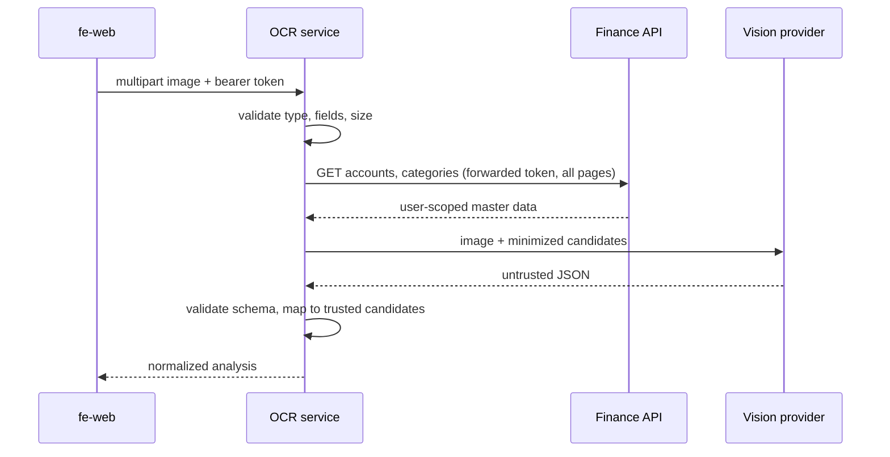

# be-ai-ocr-service

A **stateless service that reads a receipt photo and returns a structured transaction draft** using any OpenAI-compatible vision model.


Part of [FinTrack Labs](https://github.com/fintrack-labs), a personal learning project on distributed backend design and applied AI.

<!-- TODO: contoh input struk + output JSON -->

## What it does

Upload one image (JPEG, PNG, or WebP). The service looks up the user's own accounts and categories, asks a vision model to analyze the receipt, and returns a **validated** draft such as amount, date, merchant, suggested account, and suggested category. It never saves anything; the user reviews the draft in the app and submits it separately.

## Design principles (the interesting part)

- **AI output is untrusted.** The model's JSON is schema-validated, and any account/category it picks is matched against candidates that came from the finance API. Invented IDs or names are replaced with trusted values.
- **Least data to the AI.** The provider receives the image plus a *minimized* candidate list, and never the user's bearer token.
- **Delegated authorization.** The service forwards the caller's token to the finance API, which enforces access. The OCR service has no user database and does not verify JWTs itself.
- **Stateless and private.** No images and no OCR results are persisted.
- **Adapter, not a command service.** It cannot create transactions.

## Flow



## API

`POST /v1/ocr/analyze` (default port `3000`)

- Header: `Authorization: Bearer <access token>`
- Body: `multipart/form-data` with `image` (required), optional `documentType` and `locale`
- Accepted formats: JPEG, PNG, WebP

## Tech stack

Node.js · Fastify · OpenAI-compatible chat-completions API (vision)

## Getting started

Prerequisites: Node.js (LTS), a running [`be-node-ts`](https://github.com/fintrack-labs/be-node-ts), and an API key for an OpenAI-compatible vision provider.

```bash
git clone https://github.com/fintrack-labs/be-ai-ocr-service.git
cd be-ai-ocr-service
npm install
cp .env.example .env      # provider URL, API key, finance API URL, allowed origin
npm run dev
```

<!-- TODO: samakan perintah & nama variabel dengan package.json dan .env.example -->

The AI API key and backend URLs stay server-side in this service's configuration.

## Known limitations & roadmap

- Processing is **synchronous** and sends base64 images to the provider; timeouts, payload limits, concurrency limits, and cost controls are still to be designed.
- Master data is fetched page by page; latency is not yet bounded for users with very large datasets.
- DTOs are duplicated from the finance API instead of generated from a shared contract.

## Related repositories

[`fe-web`](https://github.com/fintrack-labs/fe-web) · [`be-auth-ts`](https://github.com/fintrack-labs/be-auth-ts) · [`be-node-ts`](https://github.com/fintrack-labs/be-node-ts) · [`be-api-client-test`](https://github.com/fintrack-labs/be-api-client-test)
